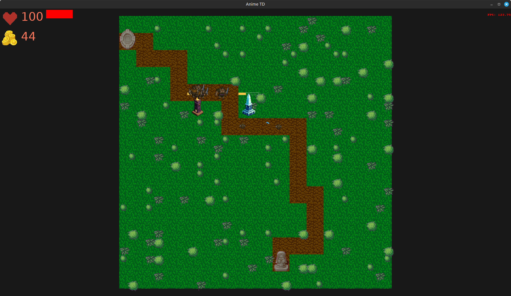
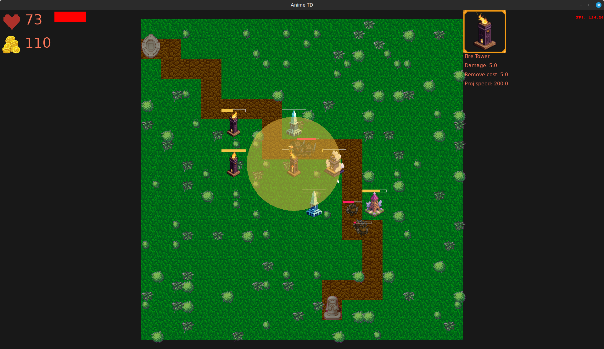
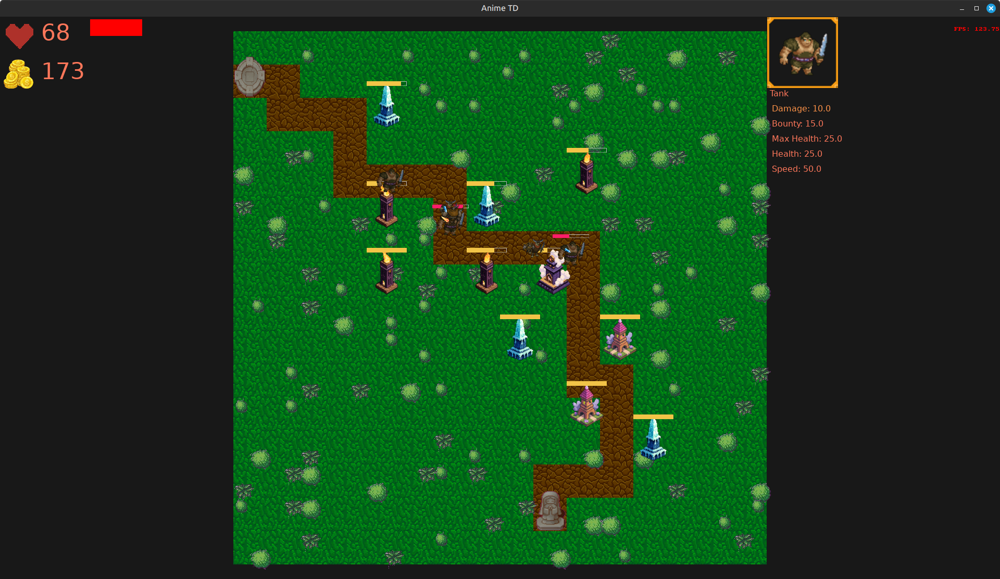

# Pixel TD

2D Pixel Tower Defance probe game with DOD and ECS like architecture

## Dependencies

Render backend is **SDL3 v3.2.20**. Cmake found_package functionality used to resolve dependencies

## Building

Build system of current project is Cmake. To build project use default cmake workflow as follow:

```bash
    mkdir build
    cd build
    cmake -S ..
```
## Images

Some demo images





## Tests


